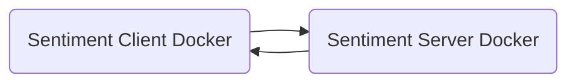

# Sentiment Client
1. Simple user interface for sentiment analysis model
2. Pull sentiment-server from docker hub using docker-compose.yml
3. REST API calling REST API within the docker network
4. The request are forwarded to another docker for predictions

# Docker Compose
docker compose build

### Run Multi-Docker Application
docker compose up

### Stop Multi-Docker Application
docker compose down
